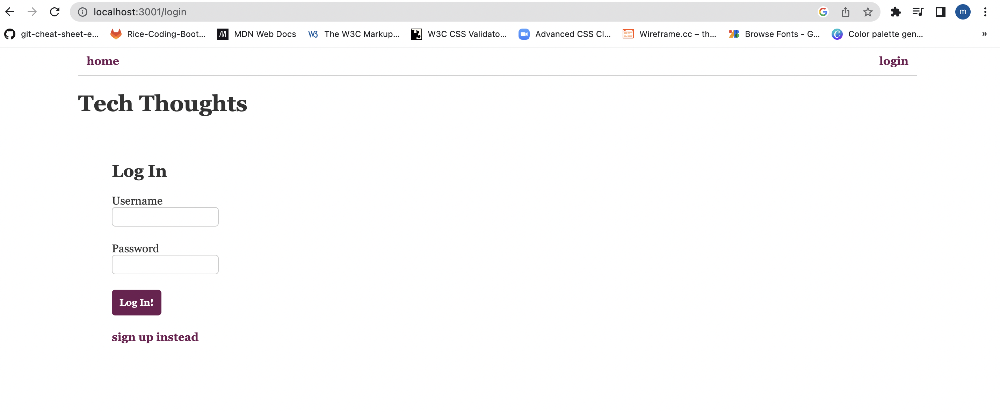
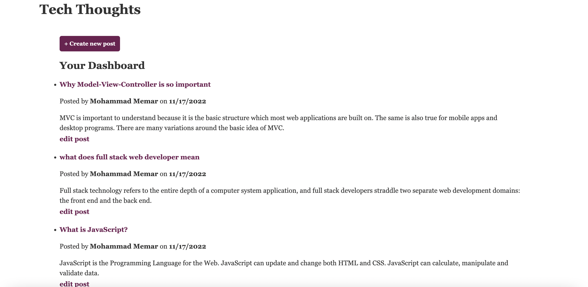

# MVC-Tech-blog

## Description

An CMS-style blog site similar to a Wordpress site, where developers can publish their blog posts and comment on other developers’ posts as well.

## Table of Contents

- [Description](#description)
- [Deployment](#deployment)
- [Technologies](#technologies)
- [Installation](#installation)
- [License](#license)
- [Questions](#questions)

## Deployment

- The is live at heroku.
- The app is deployed in heroky at https://mo-new-tech-blog.herokuapp.com/

### Screenshots

## Technologies

HTML, CSS including Bootstrap, JavaScript
MySQL
Heroku
NPM packages: bcrypt, connect-session-sequelize, dotenv, express, express-handlebars, express-session, mysql2, sequelize
